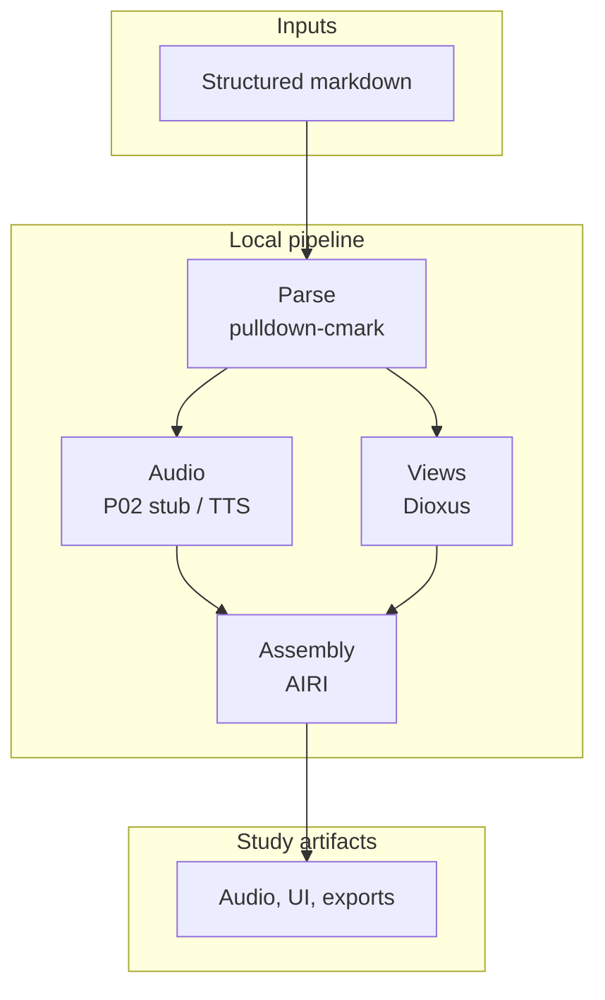

# Architecture

## System Intent

Deliver a **local**, **zero-recurring-cost** pipeline that ingests structured markdown research outputs and produces **audio narrations**, **interactive Dioxus views**, and **multimodal study artifacts** (with AIRI assembly), modeling the mechanics behind systems like NotebookLM without cloud dependencies.

**Canonical diagram sources (standard five):** [`01-system-context.mmd`](./architecture/diagrams/01-system-context.mmd), [`02-architectural-topology.mmd`](./architecture/diagrams/02-architectural-topology.mmd), [`03-deployment-topology.mmd`](./architecture/diagrams/03-deployment-topology.mmd), [`04-roadmap-phases.mmd`](./architecture/diagrams/04-roadmap-phases.mmd), [`05-data-flow.mmd`](./architecture/diagrams/05-data-flow.mmd).

## Architecture Overview

## Supplemental artifacts (`architecture/` folder)

- **`architecture/diagrams/`** — Standard set: system context, **architectural (logical) topology**, **deployment (technology) topology**, roadmap phases, data flow (see `architecture/diagrams/README.md`); add SVG/PNG under `exports/` if needed.
- **`architecture/adr/`** — Numbered ADRs; summaries below link to the full records.

## Components

| Component | Responsibility | Boundary |
|---|---|---|
| Markdown ingestion | Parse CommonMark into a structured internal representation | Trust boundary: only local files the operator selects |
| Audio bridge (P02) | Chunk/strip P01 text → **`.wav`** (default **stub** PCM; neural VibeVoice optional) | Stub: no model; neural path: GPU/RAM; no external API in **core** story |
| Dioxus UI | Present navigable, interactive knowledge views | **P03:** `knowledge_viewer` binary under `build/` (feature `viewer`); desktop target; window **Knowledge Viewer** |
| AIRI integration (**P04**) | Assemble multimodal study artifacts; **`build/integration.py`** maps paths and invokes AIRI per operator setup | Desktop app boundary; local only; **planned** until P04 **PASS** |
| Export layer (**P04**) | **`export`** binary → flashcard JSON + quiz markdown under `executions/evidence/` | Filesystem output under operator control; **planned** until P04 **PASS** |

## Key decisions (ADRs)

| ADR | Title | Record |
|-----|--------|--------|
| ADR-001 | Local-first, zero recurring cost | [ADR-001-local-first-zero-cost-multimodal-pipeline.md](./architecture/adr/ADR-001-local-first-zero-cost-multimodal-pipeline.md) |
| ADR-002 | Markdown parse via pulldown-cmark | [ADR-002-parse-markdown-with-pulldown-cmark.md](./architecture/adr/ADR-002-parse-markdown-with-pulldown-cmark.md) |
| ADR-003 | Dioxus for interactive views | [ADR-003-dioxus-for-interactive-knowledge-views.md](./architecture/adr/ADR-003-dioxus-for-interactive-knowledge-views.md) |
| ADR-004 | VibeVoice + AIRI for TTS and assembly | [ADR-004-vibevoice-tts-and-airi-multimodal-assembly.md](./architecture/adr/ADR-004-vibevoice-tts-and-airi-multimodal-assembly.md) |

## Tradeoffs

| Option | Benefits | Costs | Why chosen / why not |
|---|---|---|---|
| Local inference only | No API spend, privacy, reproducible story | Hardware floor, model download | Chosen — matches P00 cost lock ([ADR-001](./architecture/adr/ADR-001-local-first-zero-cost-multimodal-pipeline.md)) |
| Cloud TTS / LLM | Less local ops | Recurring cost, keys, egress | Rejected — violates series constraints |
| Static HTML only | Simple deploy | Weak interactivity | Rejected for P03 — Dioxus chosen ([ADR-003](./architecture/adr/ADR-003-dioxus-for-interactive-knowledge-views.md)) |

## Failure modes

| Failure Mode | Blast Radius | Detection | Mitigation |
|---|---|---|---|
| Neural TTS model missing or OOM | No neural audio | Startup error, process exit | Stub path proves pipeline without weights; document min RAM/GPU for neural |
| Desktop UI link / toolchain (P03) | Viewer fails to build or start | Compile or WebView errors | WebView2 on Windows; MSVC **LNK1104** mitigations in `build/README.md` (short `CARGO_TARGET_DIR`, etc.) |
| Malformed markdown | Downstream steps starved or wrong structure | Parse errors, empty AST | Strict parse reporting; fail fast with file/line context |
| AIRI not running or wrong version | P04 assembly fails | Integration test / connector error | Version matrix in validation; clear prereq in execution record |
| Oversized input files | Slow parse, UI freeze | Latency metrics, memory | Stream parse where possible; document max recommended size |

## Security

- **Trust boundary:** Local operator machine; all content is user-supplied markdown and local binaries.
- **Secrets:** No cloud API keys required for the core path; any optional keys must not be committed (see `build/` and `.gitignore` patterns as the repo grows).
- **Supply chain:** Pin crate and model versions in execution records and `validation.md`.

## Cost architecture

- **Target:** $0 recurring (P00 cost lock).
- **Drivers:** Optional one-time VibeVoice weight download (~3GB) for neural TTS; **stub** P02 is near-zero marginal cost; electricity and amortized hardware only.
- **Guardrails:** No paid API calls in scope; document actual resource use after P02–P04 runs.
