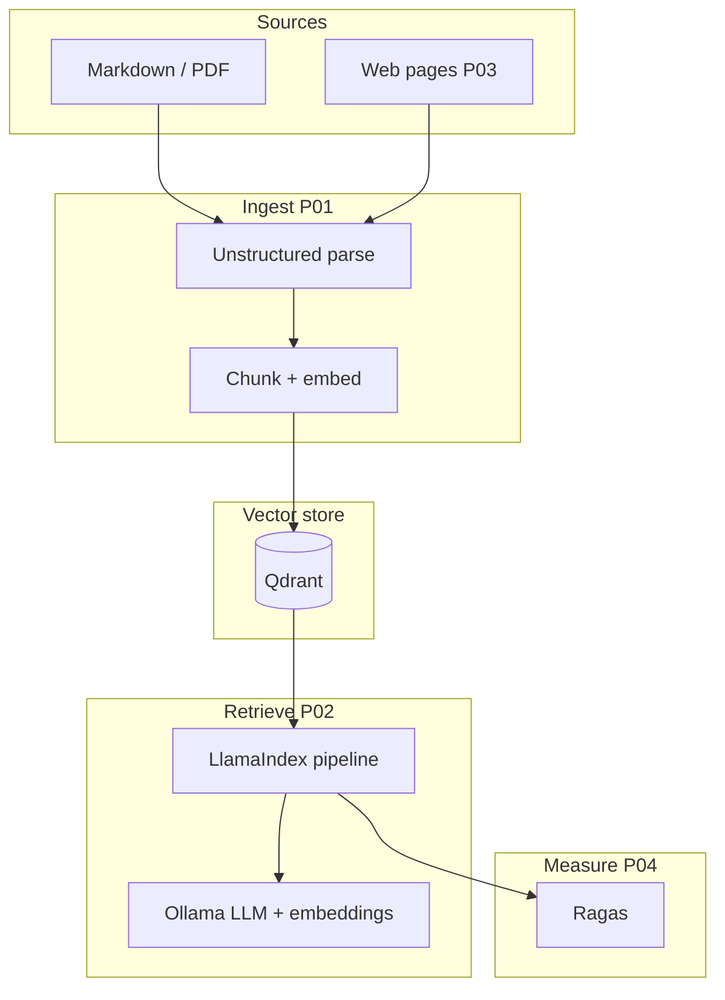

> ← [Retrieval Backbone — Multi-Domain Knowledge](./README.md) · [All Systems](../README.md) · [Home](../../README.md)

# Architecture

## System Intent

Deliver a **local-first**, **citation-aware** retrieval backbone that spans file corpora and (in later phases) crawled web pages, with **explicit quality measurement**—so downstream agentic workflows can depend on stable contracts for “what was retrieved” and “how good the answer was,” without mandatory cloud inference spend.

**Diagram sources:** [`01-system-context.mmd`](./architecture/diagrams/01-system-context.mmd), [`02-architectural-topology.mmd`](./architecture/diagrams/02-architectural-topology.mmd), [`03-deployment-topology.mmd`](./architecture/diagrams/03-deployment-topology.mmd), [`04-roadmap-phases.mmd`](./architecture/diagrams/04-roadmap-phases.mmd), [`05-data-flow.mmd`](./architecture/diagrams/05-data-flow.mmd).

## Architecture Overview

## Supplemental artifacts (`architecture/` folder)

- **`architecture/diagrams/`** — Reviewable Mermaid sources for context, logical topology, deployment, roadmap, and data flow.
- **`architecture/adr/`** — ADRs with alternatives; summaries below link to full records.

## Components

| Component | Responsibility | Boundary |
| --- | --- | --- |
| Ingestion (P01) | Parse documents, chunk, embed, upsert to Qdrant | Trust boundary: operator-supplied paths and containers only |
| Vector store | Durable chunk + metadata + vector index | Local Qdrant; no mandatory cloud control plane |
| Retrieval (P02) | Query routing, retrieval fusion, citation surfaces | LlamaIndex orchestration; Ollama for local models |
| Web integration (P03) | Fetch/normalize live pages into the same ingest contract | Firecrawl (self-hosted posture per series); rate and robots policy is operator responsibility |
| Evaluation (P04) | Ragas metrics over fixed eval sets; packaging narrative | Read-only against indexed corpora; eval prompts documented |
| Evidence | Execution record + transcripts under `executions/evidence/` | Filesystem artifacts the operator controls |

## Key decisions (ADRs)

| ADR | Title | Record |
| --- | --- | --- |
| ADR-001 | Local Ollama + Qdrant for zero recurring API posture | [ADR-001-local-ollama-qdrant-zero-recurring-cost.md](./architecture/adr/ADR-001-local-ollama-qdrant-zero-recurring-cost.md) |
| ADR-002 | LlamaIndex as orchestration layer | [ADR-002-llamaindex-orchestration-layer.md](./architecture/adr/ADR-002-llamaindex-orchestration-layer.md) |
| ADR-003 | Unstructured for heterogeneous document ingest | [ADR-003-unstructured-for-heterogeneous-document-ingest.md](./architecture/adr/ADR-003-unstructured-for-heterogeneous-document-ingest.md) |
| ADR-004 | Ragas for retrieval quality measurement | [ADR-004-ragas-for-retrieval-quality-measurement.md](./architecture/adr/ADR-004-ragas-for-retrieval-quality-measurement.md) |

## Tradeoffs

| Option | Benefits | Costs | Why chosen / why not |
| --- | --- | --- | --- |
| Local Ollama + Qdrant | No API keys for default path, reproducible | RAM/CPU, model management | Chosen — matches cost lock ([ADR-001](./architecture/adr/ADR-001-local-ollama-qdrant-zero-recurring-cost.md)) |
| Hosted OpenAI / Pinecone | Less ops burden | Recurring cost, data egress | Rejected as **default** — violates series cost posture |
| Raw SDK-only (no LlamaIndex) | Minimal abstraction | More glue code, harder citation patterns | Rejected — LlamaIndex chosen for pipeline composition ([ADR-002](./architecture/adr/ADR-002-llamaindex-orchestration-layer.md)) |
| Ad hoc parsers per MIME type | No Unstructured dependency | Fragmented coverage, fragile PDF/HTML | Rejected — Unstructured as canonical ingest ([ADR-003](./architecture/adr/ADR-003-unstructured-for-heterogeneous-document-ingest.md)) |
| Human-only or ad hoc eval | Simple to start | Not reproducible across runs | Rejected for P04 story — Ragas baseline ([ADR-004](./architecture/adr/ADR-004-ragas-for-retrieval-quality-measurement.md)) |

## Failure modes

| Failure Mode | Blast Radius | Detection | Mitigation |
| --- | --- | --- | --- |
| Qdrant down or wrong collection | No retrieval | Connection errors, empty search | Health check script; document Docker bring-up in `build/README.md` as phases land |
| Ollama model missing | No generation / bad embeddings | Explicit errors from client | Pin model names in validation; document `ollama pull` in user guides |
| Parser drift (Unstructured upgrade) | Chunk boundaries change, index quality shifts | Golden-file diff on sample corpus | Pin versions; re-run P01 validation after upgrades |
| Crawler blocked or abusive (P03) | Stale or empty web slice | HTTP errors, empty documents | Respect robots.txt; backoff; keep web optional until P03 |
| Eval set too small (P04) | Misleading Ragas scores | Variance run-to-run | Document sample size limits; avoid over-claiming |

## Security

- **Trust boundary:** Operator workstation and explicitly attached volumes/Docker networks. Content is user-selected files and allowed URLs.
- **Secrets:** No cloud API keys required for the default path; optional keys must never be committed.
- **Crawling:** Web fetch introduces SSRF-like risk if URLs are unconstrained—treat URL allowlists and network policy as operator responsibilities in P03.

## Cost architecture

- **Target:** $0 recurring API spend for the default local path.
- **Drivers:** Electricity, amortized hardware, optional one-time model pulls for Ollama; self-hosted Firecrawl footprint in P03 if enabled.
- **Guardrails:** Document what runs locally vs optional cloud; keep paid services out of the “happy path” narrative unless labeled optional.

## Dependency management

- **Python:** Pin dependencies per phase under `build/` (requirements files to be added with **P01**).
- **Containers:** Pin Qdrant (and crawler) image tags in runbooks as they appear.
- **Models:** Record Ollama tags used during validation.
