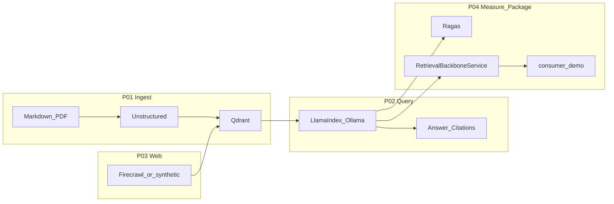

> ← [Case study](./README.md) · [System README](../README.md)

# Scenario — Local knowledge spine for a small platform team

## Cast and problem

A **platform team** maintains internal how-to notes (Markdown), a few **policy excerpts** (described in corpus text; optional real PDFs), and needs **current public reference** material (e.g. Python docs on virtual environments) without shipping data to paid APIs.

**Problem:** One-off scripts per question do not scale; answers **drift** when chunks or models change; **citations** are often missing; **quality is unmeasured**.

**This case study** shows the four shipped projects working as **one backbone**: index heterogeneous sources (**P01**), answer with **traceable citations** (**P02**), add **web-shaped** chunks with **`source_url`** provenance (**P03**), then **measure** and **package** the path for downstream use (**P04**).

## Success picture (maps to R1–R4)

| Requirement | What “good” looks like | Phase |
|-------------|------------------------|-------|
| **R1** | Markdown (and optionally PDF) lives in Qdrant **`multi_domain_docs`** with stable chunk metadata | P01 |
| **R2** | Fixed questions return answers whose **Citations** map to stored nodes | P02 |
| **R3** | At least one **web-derived** chunk participates; citations can show **`source_url:`** | P03 |
| **R4** | **Ragas** reports **context_precision** and **answer_relevancy** on a small eval set; **consumer** script uses only the public service API | P04 |

## Eval alignment (three domains)

The reference **`build/ragas_eval.py`** batch eval uses three labeled rows—**markdown file**, **pdf_topic** (grounded in corpus text about PDF + Unstructured), and **web_synthetic** (PEP 405 / virtual environments). Running the case study end-to-end with committed **`build/data/sample.md`** plus **`ingest_web.py --synthetic-evidence`** exercises the same story a reviewer can verify in [`executions/evidence/p04/`](../executions/evidence/p04/).

See [data/queries.md](./data/queries.md) for the exact question strings.

## Constraints (from business context)

- **$0 recurring** default: **Ollama** + local **Qdrant**; no mandatory cloud inference for the baseline path.
- **Portfolio / lab** context: no production SLA, multi-tenant product, or compliance certification claims.
- **Firecrawl** may be **self-hosted** or **unavailable**; **`ingest_web.py --synthetic-evidence`** proves the same index + citation contract without live crawl.

## Explicit non-goals

- Replacing a vendor product feature-for-feature.
- Authn/z, enterprise IAM, or regulated deployment.
- Guaranteed latency at arbitrary scale without documented hardware.
- Fine-tuning embedding or chat models.

## Flow (diagram)

See [diagrams/e2e-flow.mmd](./diagrams/e2e-flow.mmd) (Mermaid source).

