# Build an AI Job Application Pipeline

> Inside the [Agentic Systems Engineering](../../README.md) portfolio · *AI agents and orchestration that move from prompt to outcome.*

## Overview

I successfully prepared the development environment required to build a multi-agent job application system by validating Node.js, Python, Git, and Obsidian, configuring the filesystem MCP server in Claude Desktop, and confirming Codex CLI authentication. This established a shared workspace where agents can access and update information stored within a centralized vault while maintaining traceability across the pipeline.

The primary objective of this project was to create a repeatable application workflow that raises consistency, reduces manual effort, and increases confidence in generated application materials. Instead of relying on a single AI model, the system uses independent validation between Claude and Codex to create a governance layer that helps identify unsupported claims before documents reach final review. This approach places evidence verification at the center of the application process and creates a structured path from job discovery to submission readiness.

The architecture is built across **10 phases**, anchored by **The Mission: Building an Unfair Advantage in a Crowded Market** on the input side and **The Adversarial Council: A Self-Refining Pipeline** at the end. Each phase is listed in the Implementation section below.

## Architecture

```mermaid
---
title: 12-Agent Job Application Pipeline with Dual-Model Adversarial Council
---
%%{init: {"theme":"base","themeVariables": {"primaryColor":"#1B4332","primaryTextColor":"#F4D03F","primaryBorderColor":"#F4D03F","secondaryColor":"#264653","tertiaryColor":"#2F5233","lineColor":"#F4D03F","fontFamily":"ui-monospace, SFMono-Regular, Menlo, Consolas, monospace","fontSize":"13px"}}}%%
flowchart LR
    classDef datastore fill:#264653,stroke:#F4D03F,stroke-width:2px,color:#FFFFFF
    classDef service fill:#1B4332,stroke:#F4D03F,stroke-width:2px,color:#F4D03F
    classDef event fill:#7B42BC,stroke:#F4D03F,stroke-width:2px,color:#FFFFFF
    classDef io fill:#0d1117,stroke:#F4D03F,stroke-width:1.5px,color:#F4D03F,font-style:italic

    Roy[/"Roy (operator + final approver)"/]
    Recruiter[/"Recruiter response / interview / rejection"/]
    SubmittedPackage[/"Submission-ready application package"/]

    subgraph Toolchain["Local Toolchain"]
        Node("Node.js + Python + Git")
        ClaudeDesktop("Claude Desktop")
        CodexCLI("Codex CLI")
        Obsidian("Obsidian Studio vault")
        FilesystemMCP("filesystem MCP server")
    end

    subgraph DualModelStrategy["Dual-Model Adversarial Strategy"]
        ClaudeGen("Claude: generates resumes + cover letters + content")
        CodexValidate("Codex CLI: independent adversarial fact-check")
        ModelFamilySeparation{{"Different model families = different failure patterns"}}
        NoSelfApprove{{"Validation authority external to proposing model"}}
    end

    subgraph ThreePerspectiveAudit["3-Perspective Career Audit"]
        Recruiter1("Recruiter lens: qualification alignment")
        HiringManager("Hiring Manager lens: role fit + business value")
        LeadEngineer("Lead Engineer lens: technical depth + execution")
        AILeadersGap[(AI Leaders bucket = lowest score)]
        PublishArtifactRec[(Top recommendation: publish the pipeline itself)]
    end

    subgraph ClientIdentity["Vault: Roy's Client Identity Config"]
        RoleFamilies[(4 role families: Sr Cloud Eng / Cloud Arch / EM / Staff Eng)]
        HiringBuckets[(4 buckets: AI Leaders / Big Tech / Gov Contractors / Other)]
        ExclusionRules[(Exclusion criteria: geo + clearance + filter)]
        ScoringCriteria[(Scoring framework)]
    end

    subgraph TeamA["Team A: Source Claims (3 agents)"]
        ResumeIngest("Resume ingest")
        AtomicClaims[(Atomic evidence-backed claims)]
        EvidenceRepo[(Evidence repository with artifacts)]
        FourVariants[(4 category-tuned resume variants)]
    end

    subgraph TeamB["Team B: Opportunity Discovery (3 agents)"]
        LinkedInChannel("LinkedIn channel: manual selections")
        AlertsChannel("Google Alerts channel: keyword monitoring")
        CareerPageChannel("Career page channel: direct review")
        CommonIntake[(Common intake file)]
        FitScoring("Fit scoring + bucket assignment")
        Prioritization("Prioritization queue")
    end

    subgraph TeamC["Team C: Application Generation (3 agents)"]
        ResumeGen("Resume generator")
        CoverLetterGen("Cover letter generator")
        InterviewPrep("Interview-prep generator")
        ParallelExec{{"Parallel execution once prerequisites met"}}
    end

    subgraph TeamD["Team D: Validation Gate (3 agents)"]
        D1FactCheck("D1: Codex fact-check vs evidence")
        D1Fail{{"D1 fail -> halt downstream + manual review"}}
        D2QualityReview("D2: quality review")
        D3FinalApproval("D3: final approval")
        TwelveClaimsFlag[/"Initial run: 12 of 12 claims flagged for missing artifacts"/]
    end

    subgraph DependencyGraph["Dependency Graph as Governance"]
        BlockingRule{{"Blocking rule: bad evidence halts pipeline"}}
        NoSelfApproveGate{{"Generators cannot approve themselves"}}
        ScoredOnly{{"Generators see only scored + validated source"}}
    end

    subgraph CommandDashboard["Command-Center Dashboard"]
        NextJSApp("Next.js + TypeScript + Tailwind + Recharts")
        SQLiteDB[(SQLite schema: lifecycles + claims + variants + metrics + activity log)]
        HomeView("Home view")
        QueueView("Queue view")
        JobDetailView("Job detail view")
        WeeklyMetrics[(Weekly metrics + throughput benchmarks)]
        ActivityLog[(Activity audit trail)]
    end

    subgraph GmailIntegration["Gmail Response Tracking"]
        GmailOAuth("Gmail API: OAuth read-only")
        ResponseClassify("Response classifier")
        InterviewRequest{{"Interview request"}}
        Rejection{{"Rejection"}}
        Outreach{{"Recruiter outreach"}}
        OutcomeCorrelation[(Variant -> outcome correlation)]
    end

    subgraph AdversarialCouncil["Adversarial Council: Self-Refining"]
        ClaudeProposal("Claude proposes changes from observed results")
        CodexRiskEval("Codex evaluates: statistical validity + resume drift + content quality + bucket concentration + claim consistency")
        ProtocolViolation{{"Protocol violations escalate to manual review"}}
        ControlledLoop("Controlled feedback loop")
    end

    subgraph ValidationRun["End-to-End Pipeline Validation"]
        TenSeed[/"10 seed applications"/]
        TwentySevenURLs[/"27 URLs processed in 50-55 minutes"/]
        TenToElevenMin[/"Avg 10-11 min per qualifying package"/]
        Bottlenecks[(Constraints: qualification filtering / missing artifacts / exclusion rules)]
    end

    Roy --> Toolchain
    Roy --> Obsidian
    FilesystemMCP --> Obsidian
    ClaudeDesktop --> ClaudeGen
    CodexCLI --> CodexValidate
    ModelFamilySeparation -.principle.-> DualModelStrategy
    NoSelfApprove -.principle.-> DualModelStrategy

    Recruiter1 --> AILeadersGap
    HiringManager --> AILeadersGap
    LeadEngineer --> AILeadersGap
    AILeadersGap --> PublishArtifactRec

    Roy --> ClientIdentity
    ResumeIngest --> AtomicClaims
    AtomicClaims --> EvidenceRepo
    AtomicClaims --> FourVariants
    RoleFamilies -.shapes.-> FourVariants

    LinkedInChannel --> CommonIntake
    AlertsChannel --> CommonIntake
    CareerPageChannel --> CommonIntake
    CommonIntake --> FitScoring
    ClientIdentity -.scoring rubric.-> FitScoring
    FitScoring --> Prioritization

    Prioritization --> TeamC
    FourVariants --> ResumeGen
    EvidenceRepo --> ResumeGen
    EvidenceRepo --> CoverLetterGen
    ResumeGen --> ParallelExec
    CoverLetterGen --> ParallelExec
    InterviewPrep --> ParallelExec
    ParallelExec --> D1FactCheck

    CodexValidate --> D1FactCheck
    EvidenceRepo -.checked against.-> D1FactCheck
    D1FactCheck -.fail.-> D1Fail
    D1FactCheck -.pass.-> D2QualityReview
    D2QualityReview --> D3FinalApproval
    D3FinalApproval --> Roy
    Roy --> SubmittedPackage
    TwelveClaimsFlag -.first-run validation.-> D1FactCheck

    BlockingRule -.enforces.-> D1Fail
    NoSelfApproveGate -.enforces.-> D3FinalApproval
    ScoredOnly -.restricts.-> TeamC

    NextJSApp --> HomeView
    NextJSApp --> QueueView
    NextJSApp --> JobDetailView
    SQLiteDB -.backs.-> NextJSApp
    SQLiteDB --> ActivityLog
    SQLiteDB --> WeeklyMetrics
    ResumeGen -.logs to.-> ActivityLog
    D1FactCheck -.logs to.-> ActivityLog

    Recruiter --> GmailOAuth
    GmailOAuth --> ResponseClassify
    ResponseClassify --> InterviewRequest
    ResponseClassify --> Rejection
    ResponseClassify --> Outreach
    ResponseClassify --> OutcomeCorrelation
    OutcomeCorrelation -.feeds.-> WeeklyMetrics

    WeeklyMetrics --> ClaudeProposal
    ClaudeProposal --> CodexRiskEval
    CodexRiskEval -.violation.-> ProtocolViolation
    CodexRiskEval -.pass.-> ControlledLoop
    ControlledLoop -.refines.-> ClientIdentity
    ControlledLoop -.refines.-> FourVariants

    TenSeed --> TwentySevenURLs
    TwentySevenURLs --> TenToElevenMin
    TwentySevenURLs --> Bottlenecks
    class Node,ClaudeDesktop,CodexCLI,Obsidian,FilesystemMCP service
    class ClaudeGen,CodexValidate,Recruiter1,HiringManager,LeadEngineer service
    class ResumeIngest,LinkedInChannel,AlertsChannel,CareerPageChannel,FitScoring,Prioritization service
    class ResumeGen,CoverLetterGen,InterviewPrep service
    class D1FactCheck,D2QualityReview,D3FinalApproval service
    class NextJSApp,HomeView,QueueView,JobDetailView,GmailOAuth,ResponseClassify service
    class ClaudeProposal,CodexRiskEval,ControlledLoop service
    class AtomicClaims,EvidenceRepo,FourVariants,CommonIntake,SQLiteDB,WeeklyMetrics,ActivityLog,OutcomeCorrelation datastore
    class RoleFamilies,HiringBuckets,ExclusionRules,ScoringCriteria,AILeadersGap,PublishArtifactRec datastore
    class Bottlenecks datastore
    class ModelFamilySeparation,NoSelfApprove,D1Fail,ParallelExec,BlockingRule,NoSelfApproveGate,ScoredOnly event
    class InterviewRequest,Rejection,Outreach,ProtocolViolation event
    class Roy,Recruiter,SubmittedPackage,TenSeed,TwentySevenURLs,TenToElevenMin,TwelveClaimsFlag io
```

The diagram shows the topology and data flow of the system as built. The full architectural narrative, with screenshots and prose, lives in [`documents/12-agent-job-application-pipeline.md`](./documents/12-agent-job-application-pipeline.md).

## Implementation

This system is built across **10 phases**:

1. **The Mission: Building an Unfair Advantage in a Crowded Market**
2. **Designing the 12-Agent Architecture**
3. **Auditing Roy's Professional Presence Through Three Expert Lenses**
4. **Defining the Target: Vault Architecture and Client Identity**
5. **Writing the 12-Agent Library Across Four Teams**
6. **Ingesting Roy's Resume and Generating Four Category Variants**
7. **Building the Command-Center Dashboard**
8. **Wiring Gmail API for Automated Response Tracking**
9. **Validating the Full Pipeline End-to-End**
10. **The Adversarial Council: A Self-Refining Pipeline**

For the full walkthrough with screenshots and step-by-step content, see [`documents/12-agent-job-application-pipeline.md`](./documents/12-agent-job-application-pipeline.md).

## Validation

Each build phase below is documented in [`documents/12-agent-job-application-pipeline.md`](./documents/12-agent-job-application-pipeline.md), with screenshots, configuration, and notes as captured during the build:

- ✅ The Mission: Building an Unfair Advantage in a Crowded Market
- ✅ Designing the 12-Agent Architecture
- ✅ Auditing Roy's Professional Presence Through Three Expert Lenses
- ✅ Defining the Target: Vault Architecture and Client Identity
- ✅ Writing the 12-Agent Library Across Four Teams
- ✅ Ingesting Roy's Resume and Generating Four Category Variants
- ✅ Building the Command-Center Dashboard
- ✅ Wiring Gmail API for Automated Response Tracking
- ✅ Validating the Full Pipeline End-to-End
- ✅ The Adversarial Council: A Self-Refining Pipeline
