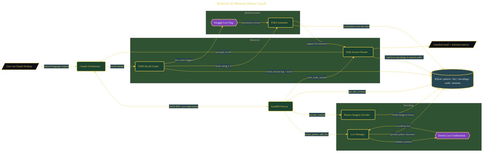

# Build an AI Memory Palace Coach

> Inside the [Agentic Systems Engineering](../../README.md) portfolio · *AI agents and orchestration that move from prompt to outcome.*

## Overview

-T-h-i-s- -p-r-o-j-e-c-t- -b-u-i-l-d-s- -a- -l-o-c-a-l- -P-y-t-h-o-n- -M-C-P- -s-e-r-v-e-r- -t-h-a-t- -t-r-a-n-s-f-o-r-m-s- -C-l-a-u-d-e- -i-n-t-o- -a- -s-t-r-u-c-t-u-r-e-d- -m-e-m-o-r-y- -p-a-l-a-c-e- -c-o-a-c-h- -u-s-i-n-g- -t-h-e- -M-e-t-h-o-d- -o-f- -L-o-c-i- -a-n-d- -F-S-R-S---b-a-s-e-d- -s-p-a-c-e-d- -r-e-p-e-t-i-t-i-o-n-.-
-
-T-h-e- -s-y-s-t-e-m- -i-s- -d-e-s-i-g-n-e-d- -t-o- -m-o-v-e- -b-e-y-o-n-d- -p-a-s-s-i-v-e- -n-o-t-e---t-a-k-i-n-g- -i-n-t-o- -a-n- -a-c-t-i-v-e- -c-o-g-n-i-t-i-v-e- -t-r-a-i-n-i-n-g- -l-o-o-p-.- -I-t- -e-n-c-o-d-e-s- -i-n-f-o-r-m-a-t-i-o-n- -i-n-t-o- -s-p-a-t-i-a-l- -m-e-m-o-r-y- -s-t-r-u-c-t-u-r-e-s-,- -r-e-i-n-f-o-r-c-e-s- -r-e-c-a-l-l- -t-h-r-o-u-g-h- -g-u-i-d-e-d- -s-e-s-s-i-o-n-s-,- -a-n-d- -s-c-h-e-d-u-l-e-s- -r-e-v-i-e-w-s- -b-a-s-e-d- -o-n- -r-e-t-e-n-t-i-o-n- -p-r-o-b-a-b-i-l-i-t-y-.- -T-h-e- -g-o-a-l- -i-s- -n-o-t- -j-u-s-t- -s-t-o-r-i-n-g- -k-n-o-w-l-e-d-g-e-,- -b-u-t- -i-m-p-r-o-v-i-n-g- -l-o-n-g---t-e-r-m- -r-e-c-a-l-l- -t-h-r-o-u-g-h- -a- -s-y-s-t-e-m- -t-h-a-t- -c-o-m-b-i-n-e-s- -s-p-a-t-i-a-l- -a-n-c-h-o-r-i-n-g-,- -i-m-a-g-e-r-y-,- -a-n-d- -a-d-a-p-t-i-v-e- -r-e-v-i-e-w- -i-n-t-e-r-v-a-l-s-.-

The architecture is built across **8 phases**, anchored by **Building an AI Memory Coach with the Science of World Champions** on the input side and **Dresler 2017 Certification Test** at the end. Each phase is listed in the Implementation section below.

## Architecture

The diagram shows the topology and data flow of the system as built. The full architectural narrative, with screenshots and prose, lives in [`documents/ai-memory-palace-coach.md`](./documents/ai-memory-palace-coach.md).

## Implementation

This system is built across **8 phases**:

1. **Building an AI Memory Coach with the Science of World Champions**
2. **Setting Up the MCP Server Foundation**
3. **Designing the Memory Palace Database**
4. **Encoding Memories with Bizarre Imagery**
5. **Building the Coached Recall and Grading System**
6. **Integrating FSRS Spaced Repetition Scheduling**
7. **Connecting to Claude Desktop and Running a Live Session**
8. **Dresler 2017 Certification Test**, -.

For the full walkthrough with screenshots and step-by-step content, see [`documents/ai-memory-palace-coach.md`](./documents/ai-memory-palace-coach.md).

## Validation

Build outcomes verified end-to-end. Each phase below is captured with screenshots, configuration, and observable behavior in [`documents/ai-memory-palace-coach.md`](./documents/ai-memory-palace-coach.md):

- ✅ Building an AI Memory Coach with the Science of World Champions
- ✅ Setting Up the MCP Server Foundation
- ✅ Designing the Memory Palace Database
- ✅ Encoding Memories with Bizarre Imagery
- ✅ Building the Coached Recall and Grading System
- ✅ Integrating FSRS Spaced Repetition Scheduling
- ✅ Connecting to Claude Desktop and Running a Live Session
- ✅ Dresler 2017 Certification Test
