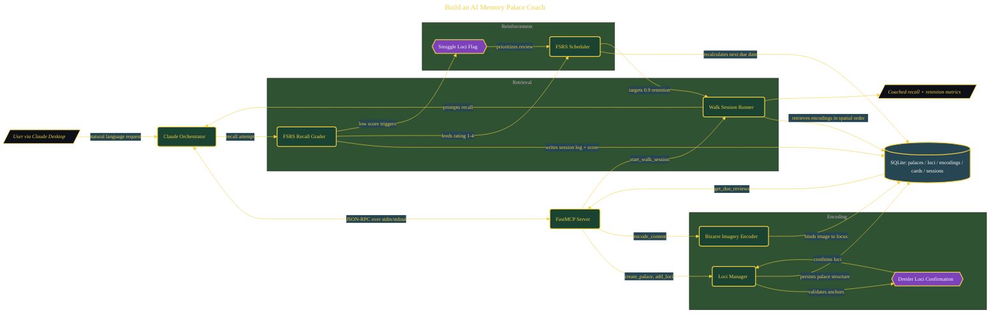

# Build an AI Memory Palace Coach

> Inside the [Agentic Systems Engineering](../../README.md) portfolio · *AI agents and orchestration that move from prompt to outcome.*

## Overview

This project builds a local Python MCP server that transforms Claude into a structured memory palace coach using the Method of Loci and FSRS-based spaced repetition.

The system is designed to move beyond passive note-taking into an active cognitive training loop. It encodes information into spatial memory structures, reinforces recall through guided sessions, and schedules reviews based on retention probability. The goal is not just storing knowledge, but improving long-term recall through a system that combines spatial anchoring, imagery, and adaptive review intervals.

The architecture is built across **8 phases**, anchored by **Building an AI Memory Coach with the Science of World Champions** on the input side and **Dresler 2017 Certification Test** at the end. Each phase is listed in the Implementation section below.

## Architecture

The diagram shows the topology and data flow of the system as built. The full architectural narrative, with screenshots and prose, lives in [`documents/ai-memory-palace-coach.md`](./documents/ai-memory-palace-coach.md).

## Implementation

This system is built across **8 phases**:

1. **Building an AI Memory Coach with the Science of World Champions**
2. **Setting Up the MCP Server Foundation**
3. **Designing the Memory Palace Database**
4. **Encoding Memories with Bizarre Imagery**
5. **Building the Coached Recall and Grading System**
6. **Integrating FSRS Spaced Repetition Scheduling**
7. **Connecting to Claude Desktop and Running a Live Session**
8. **Dresler 2017 Certification Test**

For the full walkthrough with screenshots and step-by-step content, see [`documents/ai-memory-palace-coach.md`](./documents/ai-memory-palace-coach.md).

## Validation

Each build phase below is documented in [`documents/ai-memory-palace-coach.md`](./documents/ai-memory-palace-coach.md), with screenshots, configuration, and notes as captured during the build:

- ✅ Building an AI Memory Coach with the Science of World Champions
- ✅ Setting Up the MCP Server Foundation
- ✅ Designing the Memory Palace Database
- ✅ Encoding Memories with Bizarre Imagery
- ✅ Building the Coached Recall and Grading System
- ✅ Integrating FSRS Spaced Repetition Scheduling
- ✅ Connecting to Claude Desktop and Running a Live Session
- ✅ Dresler 2017 Certification Test
