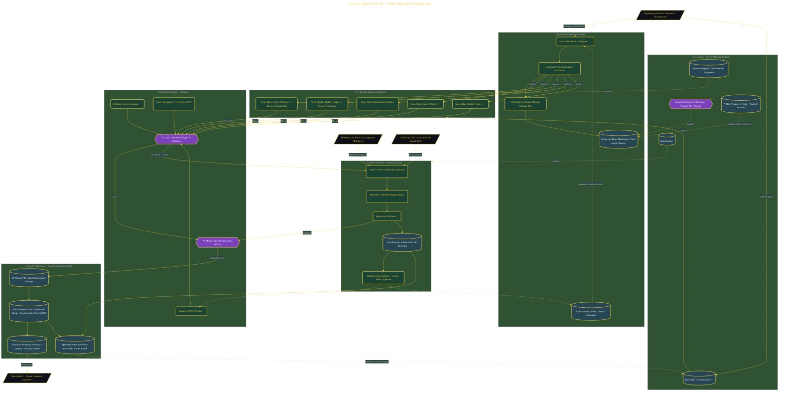

# Command a 25-Engineer AI Org in Cursor

> Inside the [Agentic Systems Engineering](../../README.md) portfolio · *AI agents and orchestration that move from prompt to outcome.*

## Overview

A simulated 90-minute engineering sprint in which 25 Cursor subagents — organized into five parallel teams (Alpha, Bravo, Charlie, Delta, Echo) — deliver a shareholder-ready software package under real DevSecOps and governance controls. The system answers a specific question about agent orchestration: *what does it take to scale AI-assisted engineering from a single coding assistant to an entire org without losing reviewability, traceability, or incident discipline?*

Concurrency comes from **Cursor `/multitask` + git worktrees**, which let five teams operate on isolated branches simultaneously rather than serially. Governance comes from branch protection, ADRs (e.g. Axum over Actix for the Rust gateway), Cursor Rules / Skills / Hooks, and a security pipeline that runs Gitleaks, Semgrep, and Trivy on every PR. A mid-sprint Murphy's Law SQL-injection incident was contained in 8 minutes MTTR, and a Zero-Day CVE all-hands drill validated cross-team remediation. The sprint produced 25 merged PRs, a 96% first-pass security-gate success rate, and a KPI dashboard + executive summary built for the board.

The architecture below shows the operating shape: Cursor Max Mode multi-agent workspace → governance + sprint planning artifacts → five parallel engineering teams via `/multitask` and worktrees → DevSecOps CI gates → incident-response and hardening loop → executive reporting + retrospective.

## Architecture

The diagram shows the topology and data flow of the system as built. The full architectural narrative, with screenshots and prose, lives in [`documents/cursor-engineering-org.md`](./documents/cursor-engineering-org.md).

## Implementation

This system is built across **8 phases**:

1. **Leading a 25-Engineer AI Organization**
2. **Establishing Governance and Branch Protection**
3. **Producing Industry-Standard Planning Artifacts**
4. **Configuring the Engineering Culture Layer and DevSecOps Pipeline**
5. **Delivering 25 PRs Through Parallel Sprint Execution**
6. **Responding to a Murphy's Law Security Incident**
7. **Delivering a Shareholder-Ready Executive Package**
8. **💎 Secret Mission: Zero-Day CVE All-Hands Incident Response**

For the full walkthrough with screenshots and step-by-step content, see [`documents/cursor-engineering-org.md`](./documents/cursor-engineering-org.md).

## Validation

Build outcomes verified end-to-end. Each phase below is captured with screenshots, configuration, and observable behavior in [`documents/cursor-engineering-org.md`](./documents/cursor-engineering-org.md):

- ✅ Leading a 25-Engineer AI Organization
- ✅ Establishing Governance and Branch Protection
- ✅ Producing Industry-Standard Planning Artifacts
- ✅ Configuring the Engineering Culture Layer and DevSecOps Pipeline
- ✅ Delivering 25 PRs Through Parallel Sprint Execution
- ✅ Responding to a Murphy's Law Security Incident
- ✅ Delivering a Shareholder-Ready Executive Package
- ✅ 💎 Secret Mission: Zero-Day CVE All-Hands Incident Response
