# Architect Your Manifesto

> Inside the [Agentic Systems Engineering](../../README.md) portfolio · *AI agents and orchestration that move from prompt to outcome.*

## Overview

In this project, I built a personal manifesto engine powered by four AI agent personas designed to transform raw voice recordings into a structured, evidence-backed narrative system. The objective was to move beyond simple journaling and create an identity knowledge platform capable of organizing memories, values, decisions, and lived experiences into a longitudinal representation of self.

The platform combined voice ingestion, staged validation pipelines, adversarial review, Obsidian knowledge graphs, and multi-agent orchestration into a single workflow. Instead of generating motivational content, the system focused on evidence, continuity, and reflective accuracy to preserve identity with traceable provenance.

The architecture is built across **11 phases**, anchored by **Laying the Foundation** on the input side and **Brand Voice Export** at the end. Each phase is listed in the Implementation section below.

## Architecture

```mermaid
---
title: Four-Persona Manifesto Engine
---
%%{init: {"theme":"base","themeVariables": {"primaryColor":"#1B4332","primaryTextColor":"#F4D03F","primaryBorderColor":"#F4D03F","secondaryColor":"#264653","tertiaryColor":"#2F5233","lineColor":"#F4D03F","fontFamily":"ui-monospace, SFMono-Regular, Menlo, Consolas, monospace","fontSize":"13px"}}}%%
flowchart LR
    classDef datastore fill:#264653,stroke:#F4D03F,stroke-width:2px,color:#FFFFFF
    classDef service fill:#1B4332,stroke:#F4D03F,stroke-width:2px,color:#F4D03F
    classDef event fill:#7B42BC,stroke:#F4D03F,stroke-width:2px,color:#FFFFFF
    classDef io fill:#0d1117,stroke:#F4D03F,stroke-width:1.5px,color:#F4D03F,font-style:italic

    Voice[/"Raw voice recordings"/]
    Operator[/"Operator (onboarding interview)"/]

    subgraph Toolchain["Local Toolchain"]
        Python("Python orchestrator")
        NodeJS("Node.js runtime")
        Pydantic("pydantic + pyyaml schema gates")
        Whisper("faster-whisper local STT")
    end

    subgraph BuildAgents["Three Parallel Build Agents"]
        AgentA("Agent A: storage + vault + stage gates")
        AgentB("Agent B: extraction + confidence + canon")
        AgentC("Agent C: drafting + Counsel + reports")
    end

    subgraph FourPersonas["Four Expert Personas"]
        Ghostwriter("Ghostwriter (Claude): narrative voice")
        Interviewer("Interviewer (Claude): belief surfacing")
        Architect("Architect (Claude): chapter structure")
        Counsel("Counsel (Gemini): adversarial review")
    end

    subgraph ModelSeparation["Adversarial Model-Family Separation"]
        ClaudeFamily{{"Claude family: build agents"}}
        GeminiFamily{{"Gemini family: review only"}}
        ChecksumLocked[(Checksum-locked Counsel prompts)]
        StrippedPayload{{"Sensitive claims stripped before review"}}
    end

    subgraph IngestionPipeline["Voice to Staged Transcripts"]
        Raw[(data/00-raw/)]
        Staged[(data/01-staged/)]
        Frontmatter[(Provenance frontmatter: id, date, source, stage)]
        FilterDrift{{"Filter prior outputs + generated chapters"}}
    end

    subgraph ClaimExtraction["Atomic Claim Extraction"]
        Transcripts("Staged transcripts")
        Extracted[("607 atomic claims (458 experiences)")]
        ConfidenceGate{{"Confidence gate"}}
        Canon[(Canon claims)]
        Clarify("Clarification requests for low-confidence claims")
        Private{{"Default-private sensitivity classification"}}
    end

    subgraph ChapterDrafting["Chapter Drafting + Revision"]
        ThirteenChapters[(13-chapter manuscript structure)]
        VoiceCheck{{"Voice fidelity check"}}
        RevisionLoop("Revision waves with user notes")
    end

    subgraph CounselReview["Counsel Adversarial Gate (Read-Only)"]
        Contradiction("Contradiction detection")
        Unsupported("Unsupported claims")
        Coherence("Coherence + narrative gaps")
        SelfDeception("Self-deception analysis")
        CarryoverTrack("Revision carryover tracking")
        SeverityScore[(Severity scoring)]
    end

    subgraph KnowledgeVault["Obsidian Identity Graph"]
        ObsidianVault[(Obsidian vault)]
        DataviewQueries("Dataview queries")
        IdentityGraph("Searchable identity graph")
        ChapterClaimLinks("Chapter-to-claim links")
    end

    subgraph Visualization["Dashboards + Identity Reports"]
        Dashboard("Identity dashboard")
        IdentityReport[(Longitudinal identity report)]
        VocabAnalysis("Vocabulary gap analysis")
    end

    subgraph WeeklyPipeline["Sunday Living Pipeline"]
        Scheduler("Weekly scheduler")
        RunnerJournal[(.runner-journal.json)]
        IsolatedStages{{"Per-stage isolation: success/failure/skipped"}}
    end

    subgraph SecretMission["Secret Mission: Brand-Voice Export"]
        ManifestoSafe[(4 manifesto-safe canon claims)]
        Positioning("Positioning statement draft")
        CounselReviewSM("Counsel review on positioning")
    end

    Voice --> Whisper
    Whisper --> Raw
    Raw --> Staged
    Staged --> Frontmatter
    FilterDrift -.gates ingest.-> Staged

    Operator -.onboarding tone + audience.-> FourPersonas
    Python --> BuildAgents
    Pydantic -.contract.-> BuildAgents

    AgentA --> ObsidianVault
    AgentA --> Raw
    AgentA --> Staged
    AgentB --> Transcripts
    AgentC --> ChapterDrafting

    Staged --> Transcripts
    Transcripts --> Extracted
    Extracted --> ConfidenceGate
    ConfidenceGate -.high.-> Canon
    ConfidenceGate -.low.-> Clarify
    Private -.classifies.-> Extracted

    Canon --> ThirteenChapters
    Ghostwriter --> ThirteenChapters
    Architect -.maintains.-> ThirteenChapters
    Interviewer -.surfaces from.-> Transcripts
    ThirteenChapters --> VoiceCheck
    VoiceCheck --> RevisionLoop

    RevisionLoop --> Counsel
    Counsel --> Contradiction
    Counsel --> Unsupported
    Counsel --> Coherence
    Counsel --> SelfDeception
    Counsel --> CarryoverTrack
    Counsel --> SeverityScore
    SeverityScore -.read-only feedback.-> RevisionLoop

    ClaudeFamily -.runs.-> Ghostwriter
    ClaudeFamily -.runs.-> Interviewer
    ClaudeFamily -.runs.-> Architect
    GeminiFamily -.runs.-> Counsel
    ChecksumLocked -.prevents drift.-> Counsel
    StrippedPayload -.before transmission.-> Counsel

    Canon --> ObsidianVault
    ObsidianVault --> DataviewQueries
    DataviewQueries --> IdentityGraph
    ThirteenChapters --> ChapterClaimLinks
    ChapterClaimLinks --> ObsidianVault

    IdentityGraph --> Dashboard
    Dashboard --> IdentityReport
    Dashboard --> VocabAnalysis

    Scheduler --> IngestionPipeline
    Scheduler --> ClaimExtraction
    Scheduler --> ChapterDrafting
    Scheduler --> CounselReview
    Scheduler --> Visualization
    IsolatedStages -.records to.-> RunnerJournal

    Canon --> ManifestoSafe
    ManifestoSafe --> Positioning
    Positioning --> CounselReviewSM
    class Python,NodeJS,Pydantic,Whisper,Ghostwriter,Interviewer,Architect,Counsel service
    class AgentA,AgentB,AgentC,Dashboard,VocabAnalysis,Positioning,CounselReviewSM service
    class Contradiction,Unsupported,Coherence,SelfDeception,CarryoverTrack,DataviewQueries,IdentityGraph,ChapterClaimLinks,Scheduler service
    class Raw,Staged,Frontmatter,Extracted,Canon,ThirteenChapters,ChecksumLocked,SeverityScore,ObsidianVault,IdentityReport,RunnerJournal,ManifestoSafe datastore
    class ClaudeFamily,GeminiFamily,StrippedPayload,FilterDrift,ConfidenceGate,Private,VoiceCheck,IsolatedStages event
    class Voice,Operator,Clarify,Transcripts,RevisionLoop io
```

The diagram shows the topology and data flow of the system as built. The full architectural narrative, with screenshots and prose, lives in [`documents/four-persona-manifesto-engine.md`](./documents/four-persona-manifesto-engine.md).

## Implementation

This system is built across **11 phases**:

1. **Laying the Foundation**
2. **Designing the Architecture with ADRs and Diagrams**
3. **Defining Four Expert Agent Personas**
4. **Building the Pipeline with Parallel Agents**
5. **Ingesting Raw Voice into Structured Data**
6. **Extracting Beliefs with the Interview Agent**
7. **Drafting the Manifesto Chapters**
8. **Running Adversarial Counsel Quality Gates**
9. **Visualizing Your Identity Landscape**
10. **Activating the Weekly Living Pipeline**
11. **Brand Voice Export**

For the full walkthrough with screenshots and step-by-step content, see [`documents/four-persona-manifesto-engine.md`](./documents/four-persona-manifesto-engine.md).

## Validation

Each build phase below is documented in [`documents/four-persona-manifesto-engine.md`](./documents/four-persona-manifesto-engine.md), with screenshots, configuration, and notes as captured during the build:

- ✅ Laying the Foundation
- ✅ Designing the Architecture with ADRs and Diagrams
- ✅ Defining Four Expert Agent Personas
- ✅ Building the Pipeline with Parallel Agents
- ✅ Ingesting Raw Voice into Structured Data
- ✅ Extracting Beliefs with the Interview Agent
- ✅ Drafting the Manifesto Chapters
- ✅ Running Adversarial Counsel Quality Gates
- ✅ Visualizing Your Identity Landscape
- ✅ Activating the Weekly Living Pipeline
- ✅ Brand Voice Export
