# Ship a Repo Explainer Pipeline

> Inside the [Agentic Systems Engineering](../../README.md) portfolio · *AI agents and orchestration that move from prompt to outcome.*

## Overview

In this project, I built a nine-agent AI orchestration pipeline that transforms a public GitHub repository into polished explainer videos and carousel decks. The objective was to simulate a production-grade content generation system where specialized agents collaborate through structured contracts instead of operating as isolated prompts.

The system combines repository analysis, storyboard generation, diagram rendering, voice synthesis, animation composition, and adversarial review into a single automated workflow. Rather than treating AI as a single assistant, the project focused on designing an orchestrated multi-agent system with typed state management, governance boundaries, and deterministic outputs.

The architecture is built across **9 phases**, anchored by **Building a Nine-Agent Content Foundry** on the input side and **Long-Mode YouTube Explainer with Chapter Markers** at the end. Each phase is listed in the Implementation section below.

## Architecture

```mermaid
---
title: Ship a Repo Explainer Pipeline
---
%%{init: {"theme":"base","themeVariables": {"primaryColor":"#1B4332","primaryTextColor":"#F4D03F","primaryBorderColor":"#F4D03F","secondaryColor":"#264653","tertiaryColor":"#2F5233","lineColor":"#F4D03F","fontFamily":"ui-monospace, SFMono-Regular, Menlo, Consolas, monospace","fontSize":"13px"}}}%%
flowchart LR
    classDef datastore fill:#264653,stroke:#F4D03F,stroke-width:2px,color:#FFFFFF
    classDef service fill:#1B4332,stroke:#F4D03F,stroke-width:2px,color:#F4D03F
    classDef event fill:#7B42BC,stroke:#F4D03F,stroke-width:2px,color:#FFFFFF
    classDef io fill:#0d1117,stroke:#F4D03F,stroke-width:1.5px,color:#F4D03F,font-style:italic

    subgraph Input["Input"]
        Repo[/Public GitHub Repo/]
    end

    subgraph Orchestrator["Orchestrator - 6-State Machine"]
        Orch(Orchestrator and Mode Router)
        Schemas[(18 Typed JSON Schemas)]
        Cache[(Warm-Start State Cache)]
    end

    subgraph Distillation["Distillation Wave - parallel limit 3"]
        Anatomist(A1 Repo Anatomist)
        Distiller(A2 System Distiller)
        BrandSlice(A4 Brand Slice)
    end

    subgraph Creative["Creative Layer"]
        Script(A3 Script and Storyboard)
        Visual(A4 Visual Director)
        Motion(A5 Motion Sequencer)
        Voice(A6 Voice Director - SSML)
        Carousel(A7 Carousel Composer)
    end

    subgraph Council["Adversarial Council - Release Gates"]
        Quality(A8 Quality Auditor)
        Compliance(A9 Compliance Gate)
    end

    subgraph Rendering["Deterministic Render Stack"]
        MermaidCli(Mermaid CLI plus Puppeteer)
        Azure(Azure Neural TTS)
        PiperTts(Piper TTS Fallback)
        Whisper(Whisper Caption Verify)
        Remotion(Remotion Video Compositor)
        Playwright(Playwright Carousel Render)
        FFmpeg(ffmpeg Mux)
    end

    subgraph Outputs["Outputs"]
        ShortVid[/Short-Form Burned Captions/]
        LongVid[/Long-Form plus SRT Sidecar/]
        Deck[/Carousel Deck/]
    end

    Veto{{Council Veto Halts Release}}

    Repo -->|analyze structure| Anatomist
    Repo -->|extract system narrative| Distiller
    Repo -->|read branding assets| BrandSlice
    Anatomist -->|repo anatomy JSON| Orch
    Distiller -->|system distillation JSON| Orch
    BrandSlice -->|brand-kit JSON| Orch
    Schemas -->|validates every payload| Orch
    Cache -->|reuses Phase 1 outputs| Orch
    Orch -->|dispatch creative wave| Script
    Orch -->|dispatch creative wave| Visual
    Orch -->|dispatch creative wave| Motion
    Orch -->|dispatch creative wave| Voice
    Orch -->|dispatch creative wave| Carousel
    Visual -->|diagram specs| MermaidCli
    Voice -->|SSML narration package| Azure
    Azure -.->|fallback on failure| PiperTts
    Motion -->|motion timing| Remotion
    Carousel -->|carousel HTML| Playwright
    MermaidCli -->|deterministic PNG| Remotion
    Remotion -->|rendered frames| FFmpeg
    Playwright -->|deck frames| FFmpeg
    FFmpeg -->|burned-caption short| ShortVid
    FFmpeg -->|long-form video| LongVid
    Playwright -->|deck export| Deck
    LongVid -->|caption sidecar audit| Whisper
    Whisper -->|transcript vs SRT diff| Compliance
    ShortVid -->|content and claims| Quality
    LongVid -->|content and claims| Quality
    Quality -->|approve or veto| Veto
    Compliance -->|approve or veto| Veto
    Veto -->|veto halts release| Orch

    class Schemas,Cache datastore
    class Orch,Anatomist,Distiller,BrandSlice,Script,Visual,Motion,Voice,Carousel,Quality,Compliance,MermaidCli,Azure,PiperTts,Whisper,Remotion,Playwright,FFmpeg service
    class Veto event
    class Repo,ShortVid,LongVid,Deck io
```

The diagram shows the topology and data flow of the system as built. The full architectural narrative, with screenshots and prose, lives in [`documents/nine-agent-repo-to-video.md`](./documents/nine-agent-repo-to-video.md).

## Implementation

This system is built across **9 phases**:

1. **Building a Nine-Agent Content Foundry**
2. **Verifying and Installing the Full Tool Chain**
3. **Designing the State Machine and JSON Contracts**
4. **Authoring the Nine Specialist Agent Definitions**
5. **Building the Orchestrator with Mode Routing and Error Handling**
6. **Assembling the Visual and Audio Pipeline**
7. **Building the Carousel and Composition Pipeline**
8. **Running the Pipeline End-to-End Against a Live Repo**
9. **Long-Mode YouTube Explainer with Chapter Markers**

For the full walkthrough with screenshots and step-by-step content, see [`documents/nine-agent-repo-to-video.md`](./documents/nine-agent-repo-to-video.md).

## Validation

Each build phase below is documented in [`documents/nine-agent-repo-to-video.md`](./documents/nine-agent-repo-to-video.md), with screenshots, configuration, and notes as captured during the build:

- ✅ Building a Nine-Agent Content Foundry
- ✅ Verifying and Installing the Full Tool Chain
- ✅ Designing the State Machine and JSON Contracts
- ✅ Authoring the Nine Specialist Agent Definitions
- ✅ Building the Orchestrator with Mode Routing and Error Handling
- ✅ Assembling the Visual and Audio Pipeline
- ✅ Building the Carousel and Composition Pipeline
- ✅ Running the Pipeline End-to-End Against a Live Repo
- ✅ Long-Mode YouTube Explainer with Chapter Markers
