# Ship a Repo Explainer Pipeline

> Inside the [Agentic Systems Engineering](../../README.md) portfolio · *AI agents and orchestration that move from prompt to outcome.*

## Overview

-I-n- -t-h-i-s- -p-r-o-j-e-c-t-,- -I- -b-u-i-l-t- -a- -n-i-n-e---a-g-e-n-t- -A-I- -o-r-c-h-e-s-t-r-a-t-i-o-n- -p-i-p-e-l-i-n-e- -t-h-a-t- -t-r-a-n-s-f-o-r-m-s- -a- -p-u-b-l-i-c- -G-i-t-H-u-b- -r-e-p-o-s-i-t-o-r-y- -i-n-t-o- -p-o-l-i-s-h-e-d- -e-x-p-l-a-i-n-e-r- -v-i-d-e-o-s- -a-n-d- -c-a-r-o-u-s-e-l- -d-e-c-k-s-.- -T-h-e- -o-b-j-e-c-t-i-v-e- -w-a-s- -t-o- -s-i-m-u-l-a-t-e- -a- -p-r-o-d-u-c-t-i-o-n---g-r-a-d-e- -c-o-n-t-e-n-t- -g-e-n-e-r-a-t-i-o-n- -s-y-s-t-e-m- -w-h-e-r-e- -s-p-e-c-i-a-l-i-z-e-d- -a-g-e-n-t-s- -c-o-l-l-a-b-o-r-a-t-e- -t-h-r-o-u-g-h- -s-t-r-u-c-t-u-r-e-d- -c-o-n-t-r-a-c-t-s- -i-n-s-t-e-a-d- -o-f- -o-p-e-r-a-t-i-n-g- -a-s- -i-s-o-l-a-t-e-d- -p-r-o-m-p-t-s-.-
-
-T-h-e- -s-y-s-t-e-m- -c-o-m-b-i-n-e-s- -r-e-p-o-s-i-t-o-r-y- -a-n-a-l-y-s-i-s-,- -s-t-o-r-y-b-o-a-r-d- -g-e-n-e-r-a-t-i-o-n-,- -d-i-a-g-r-a-m- -r-e-n-d-e-r-i-n-g-,- -v-o-i-c-e- -s-y-n-t-h-e-s-i-s-,- -a-n-i-m-a-t-i-o-n- -c-o-m-p-o-s-i-t-i-o-n-,- -a-n-d- -a-d-v-e-r-s-a-r-i-a-l- -r-e-v-i-e-w- -i-n-t-o- -a- -s-i-n-g-l-e- -a-u-t-o-m-a-t-e-d- -w-o-r-k-f-l-o-w-.- -R-a-t-h-e-r- -t-h-a-n- -t-r-e-a-t-i-n-g- -A-I- -a-s- -a- -s-i-n-g-l-e- -a-s-s-i-s-t-a-n-t-,- -t-h-e- -p-r-o-j-e-c-t- -f-o-c-u-s-e-d- -o-n- -d-e-s-i-g-n-i-n-g- -a-n- -o-r-c-h-e-s-t-r-a-t-e-d- -m-u-l-t-i---a-g-e-n-t- -s-y-s-t-e-m- -w-i-t-h- -t-y-p-e-d- -s-t-a-t-e- -m-a-n-a-g-e-m-e-n-t-,- -g-o-v-e-r-n-a-n-c-e- -b-o-u-n-d-a-r-i-e-s-,- -a-n-d- -d-e-t-e-r-m-i-n-i-s-t-i-c- -o-u-t-p-u-t-s-.-

The architecture is built across **9 phases**, anchored by **Building a Nine-Agent Content Foundry** on the input side and **Long-Mode YouTube Explainer with Chapter Markers** at the end. Each phase is listed in the Implementation section below.

## Architecture

```mermaid
---
title: Ship a Repo Explainer Pipeline
---
%%{init: {"theme":"base","themeVariables": {"primaryColor":"#1B4332","primaryTextColor":"#F4D03F","primaryBorderColor":"#F4D03F","secondaryColor":"#264653","tertiaryColor":"#2F5233","lineColor":"#F4D03F","fontFamily":"ui-monospace, SFMono-Regular, Menlo, Consolas, monospace","fontSize":"13px"}}}%%
flowchart LR
    classDef datastore fill:#264653,stroke:#F4D03F,stroke-width:2px,color:#FFFFFF
    classDef service fill:#1B4332,stroke:#F4D03F,stroke-width:2px,color:#F4D03F
    classDef event fill:#7B42BC,stroke:#F4D03F,stroke-width:2px,color:#FFFFFF
    classDef io fill:#0d1117,stroke:#F4D03F,stroke-width:1.5px,color:#F4D03F,font-style:italic

    subgraph Input["Input"]
        Repo[/Public GitHub Repo/]
    end

    subgraph Orchestrator["Orchestrator - 6-State Machine"]
        Orch(Orchestrator and Mode Router)
        Schemas[(18 Typed JSON Schemas)]
        Cache[(Warm-Start State Cache)]
    end

    subgraph Distillation["Distillation Wave - parallel limit 3"]
        Anatomist(A1 Repo Anatomist)
        Distiller(A2 System Distiller)
        BrandSlice(A4 Brand Slice)
    end

    subgraph Creative["Creative Layer"]
        Script(A3 Script and Storyboard)
        Visual(A4 Visual Director)
        Motion(A5 Motion Sequencer)
        Voice(A6 Voice Director - SSML)
        Carousel(A7 Carousel Composer)
    end

    subgraph Council["Adversarial Council - Release Gates"]
        Quality(A8 Quality Auditor)
        Compliance(A9 Compliance Gate)
    end

    subgraph Rendering["Deterministic Render Stack"]
        MermaidCli(Mermaid CLI plus Puppeteer)
        Azure(Azure Neural TTS)
        PiperTts(Piper TTS Fallback)
        Whisper(Whisper Caption Verify)
        Remotion(Remotion Video Compositor)
        Playwright(Playwright Carousel Render)
        FFmpeg(ffmpeg Mux)
    end

    subgraph Outputs["Outputs"]
        ShortVid[/Short-Form Burned Captions/]
        LongVid[/Long-Form plus SRT Sidecar/]
        Deck[/Carousel Deck/]
    end

    Veto{{Council Veto Halts Release}}

    Repo -->|analyze structure| Anatomist
    Repo -->|extract system narrative| Distiller
    Repo -->|read branding assets| BrandSlice
    Anatomist -->|repo anatomy JSON| Orch
    Distiller -->|system distillation JSON| Orch
    BrandSlice -->|brand-kit JSON| Orch
    Schemas -->|validates every payload| Orch
    Cache -->|reuses Phase 1 outputs| Orch
    Orch -->|dispatch creative wave| Script
    Orch -->|dispatch creative wave| Visual
    Orch -->|dispatch creative wave| Motion
    Orch -->|dispatch creative wave| Voice
    Orch -->|dispatch creative wave| Carousel
    Visual -->|diagram specs| MermaidCli
    Voice -->|SSML narration package| Azure
    Azure -.->|fallback on failure| PiperTts
    Motion -->|motion timing| Remotion
    Carousel -->|carousel HTML| Playwright
    MermaidCli -->|deterministic PNG| Remotion
    Remotion -->|rendered frames| FFmpeg
    Playwright -->|deck frames| FFmpeg
    FFmpeg -->|burned-caption short| ShortVid
    FFmpeg -->|long-form video| LongVid
    Playwright -->|deck export| Deck
    LongVid -->|caption sidecar audit| Whisper
    Whisper -->|transcript vs SRT diff| Compliance
    ShortVid -->|content and claims| Quality
    LongVid -->|content and claims| Quality
    Quality -->|approve or veto| Veto
    Compliance -->|approve or veto| Veto
    Veto -->|veto halts release| Orch

    class Schemas,Cache datastore
    class Orch,Anatomist,Distiller,BrandSlice,Script,Visual,Motion,Voice,Carousel,Quality,Compliance,MermaidCli,Azure,PiperTts,Whisper,Remotion,Playwright,FFmpeg service
    class Veto event
    class Repo,ShortVid,LongVid,Deck io
```

The diagram shows the topology and data flow of the system as built. The full architectural narrative, with screenshots and prose, lives in [`documents/nine-agent-repo-to-video.md`](./documents/nine-agent-repo-to-video.md).

## Implementation

This system is built across **9 phases**:

1. **Building a Nine-Agent Content Foundry**
2. **Verifying and Installing the Full Tool Chain**, -.
3. **Designing the State Machine and JSON Contracts**
4. **Authoring the Nine Specialist Agent Definitions**
5. **Building the Orchestrator with Mode Routing and Error Handling**
6. **Assembling the Visual and Audio Pipeline**
7. **Building the Carousel and Composition Pipeline**
8. **Running the Pipeline End-to-End Against a Live Repo**
9. **Long-Mode YouTube Explainer with Chapter Markers**, -.

For the full walkthrough with screenshots and step-by-step content, see [`documents/nine-agent-repo-to-video.md`](./documents/nine-agent-repo-to-video.md).

## Validation

Build outcomes verified end-to-end. Each phase below is captured with screenshots, configuration, and observable behavior in [`documents/nine-agent-repo-to-video.md`](./documents/nine-agent-repo-to-video.md):

- ✅ Building a Nine-Agent Content Foundry
- ✅ Verifying and Installing the Full Tool Chain
- ✅ Designing the State Machine and JSON Contracts
- ✅ Authoring the Nine Specialist Agent Definitions
- ✅ Building the Orchestrator with Mode Routing and Error Handling
- ✅ Assembling the Visual and Audio Pipeline
- ✅ Building the Carousel and Composition Pipeline
- ✅ Running the Pipeline End-to-End Against a Live Repo
- ✅ Long-Mode YouTube Explainer with Chapter Markers
