# Personal AI Research Agency

> Inside the [Agentic Systems Engineering](../../README.md) portfolio · *AI agents and orchestration that move from prompt to outcome.*

## Overview

I verified authentication for the required CLIs: Claude, Codex, and Gemini/Antigravity. I also configured the Firecrawl MCP tool inside the Claude Code environment and completed the initial scaffold for the research agency.

I populated preflight.json with system metadata, binary status, and credit limits. That file gave the build a verified operating baseline so the research workflow could track the tools, limits, and access paths it was built on.

The architecture is built across **7 phases**, anchored by **Architecting a Multi-Agent Research Firm** on the input side and **Defending Against Prompt Injection** at the end. Each phase is listed in the Implementation section below.

## Architecture

```mermaid
---
title: Personal AI Research Agency - Director-Orchestrated Multi-Agent
---
%%{init: {"theme":"base","themeVariables": {"primaryColor":"#1B4332","primaryTextColor":"#F4D03F","primaryBorderColor":"#F4D03F","secondaryColor":"#264653","tertiaryColor":"#2F5233","lineColor":"#F4D03F","fontFamily":"ui-monospace, SFMono-Regular, Menlo, Consolas, monospace","fontSize":"13px"}}}%%
flowchart LR
    classDef datastore fill:#264653,stroke:#F4D03F,stroke-width:2px,color:#FFFFFF
    classDef service fill:#1B4332,stroke:#F4D03F,stroke-width:2px,color:#F4D03F
    classDef event fill:#7B42BC,stroke:#F4D03F,stroke-width:2px,color:#FFFFFF
    classDef io fill:#0d1117,stroke:#F4D03F,stroke-width:1.5px,color:#F4D03F,font-style:italic

    Question[/Research Question - SQ1 to SQ5/]
    Packages[/2 Decision-Grade Research Packages/]

    subgraph Preflight["Preflight Environment - ground truth"]
        PreflightJson[(preflight.json - verified facts)]
        Clis(Claude 2.1.123 + Codex 0.136.0 + agy 1.0.0)
        FirecrawlBal[(Firecrawl 1076 of 1000 credits)]
        Powershell(native PowerShell, subscription-flat)
    end

    subgraph Orchestration["Director - Claude Code"]
        Director(Director agent)
        ClaudeMd[(CLAUDE.md - roles, pipeline, adapter contract)]
    end

    subgraph Design["Design-First Artifacts"]
        Adr1[(ADR-1 Claude Code orchestrator)]
        Adr2[(ADR-2 modular MCP tool architecture)]
        Adr3[(ADR-3 adversarial verification + fencing)]
        Adr4[(ADR-4 subscription-only cost model)]
        ImplPlan[(Implementation Plan)]
    end

    subgraph Router["Semantic Router - by capability"]
        SubQuestions[(SQ1 to SQ5 sub-questions)]
        RouteReason{{Route reason - live data, reasoning, long-context}}
    end

    subgraph Methods["4 Research Methods"]
        Firecrawl(Firecrawl MCP - live scrape)
        Codex(Codex - evidence reasoning)
        Agy(agy - long-context reading)
        ClaudeMcp(Claude + MCP)
    end

    subgraph Adapters["Safety Layer - CLI Adapters"]
        Timeout{{120s timeout}}
        Breaker{{Circuit breaker - 3 fails, 60s cooldown}}
        Fencing(Content fencing - UNTRUSTED_DATA markers)
        ErrorDict[(error dict - clean degrade)]
    end

    subgraph Quota["Quota Tracker"]
        QuotaState[(quota_state.json - per-method counter)]
        CanDispatch{{can_dispatch check - refuse at zero}}
    end

    subgraph Defense["Prompt-Injection Defense - layered"]
        PatternScan(Pattern scanner - known phrases)
        Denylist(Reputation denylist)
        UnknownDomain{{Unknown domain - flag for verify}}
        VerifyBackstop{{Verification backstop - primary}}
    end

    subgraph Verification["Adversarial Verification"]
        Verifier(Verifier subagents)
        Grounding{{Grounding - claims to source URLs}}
    end

    subgraph Eval["Eval Harness - 6 metrics"]
        Coverage{{Coverage - 100% bar}}
        GroundMetric{{Grounding - 100% bar}}
        OtherMetrics[(Contradiction, Unsupported, Freshness, Retrievability)]
        Baseline[(Day-1 regression baselines)]
    end

    subgraph CaseStudies["Two Parallel Case Studies"]
        Sauna(Sauna buyability research)
        Brain(Brain capacity research)
        Monitor(Pipeline monitor)
        RedTeam{{Red-team hostile page}}
    end

    Clis -->|recorded in| PreflightJson
    FirecrawlBal -->|recorded in| PreflightJson
    Powershell -->|constraints in| PreflightJson
    PreflightJson -->|verified baseline| Director
    Director -->|reads roles + contract| ClaudeMd

    Adr1 -->|locks decision| Director
    Adr2 -->|locks decision| Director
    Adr3 -->|locks decision| Director
    Adr4 -->|locks decision| Director
    ClaudeMd -->|precedes| ImplPlan
    ImplPlan -->|controlled build order| Director

    Question -->|split into| SubQuestions
    SubQuestions -->|classified by| RouteReason
    Director -->|routes each SQ| RouteReason
    RouteReason -->|live data| Firecrawl
    RouteReason -->|reasoning| Codex
    RouteReason -->|long-context| Agy
    RouteReason -->|orchestration| ClaudeMcp

    Firecrawl -->|bounded by| Timeout
    Codex -->|bounded by| Timeout
    Agy -->|bounded by| Breaker
    Timeout -->|on 3 fails| Breaker
    Firecrawl -->|output wrapped by| Fencing
    Breaker -->|degrades to| ErrorDict
    CanDispatch -->|gates every call| RouteReason
    QuotaState -->|checked by| CanDispatch

    Fencing -->|scanned by| PatternScan
    PatternScan -->|rejects listed| Denylist
    Denylist -->|allow but| UnknownDomain
    UnknownDomain -->|escalates to| VerifyBackstop
    PatternScan -.->|semantic injection slips| VerifyBackstop

    Fencing -->|fenced data| Verifier
    Verifier -->|checks| Grounding
    VerifyBackstop -->|refuses ungrounded| Verifier
    Grounding -->|traced claims| Coverage
    Grounding -->|traced claims| GroundMetric

    Coverage -->|scored in| OtherMetrics
    GroundMetric -->|scored in| OtherMetrics
    OtherMetrics -->|frozen as| Baseline
    OtherMetrics -->|decision-grade| Packages

    RouteReason -->|exercised by| Sauna
    RouteReason -->|exercised by| Brain
    Sauna -->|watched by| Monitor
    Brain -->|watched by| Monitor
    RedTeam -.->|injection caught at| VerifyBackstop
    Monitor -->|confirms verification| Verifier

    class PreflightJson,FirecrawlBal,ClaudeMd,ErrorDict,QuotaState,OtherMetrics,Baseline,SubQuestions,Adr1,Adr2,Adr3,Adr4,ImplPlan datastore
    class Clis,Powershell,Director,Firecrawl,Codex,Agy,ClaudeMcp,Fencing,PatternScan,Denylist,Verifier,Sauna,Brain,Monitor service
    class RouteReason,Timeout,Breaker,CanDispatch,UnknownDomain,VerifyBackstop,Grounding,Coverage,GroundMetric,RedTeam event
    class Question,Packages io
```

The diagram shows the topology and data flow of the system as built. The full architectural narrative, with screenshots and prose, lives in [`documents/personal-ai-research-agency.md`](./documents/personal-ai-research-agency.md).

## Implementation

This system is built across **7 phases**:

1. **Architecting a Multi-Agent Research Firm**
2. **Configuring the Orchestration Environment**
3. **Designing the System Before Writing Code**
4. **Building the Safety Layer and Deterministic Utilities**
5. **Running Two Case Studies Simultaneously**
6. **Scoring Results and Establishing Regression Baselines**
7. **Defending Against Prompt Injection**

For the full walkthrough with screenshots and step-by-step content, see [`documents/personal-ai-research-agency.md`](./documents/personal-ai-research-agency.md).

## Validation

Each build phase below is documented in [`documents/personal-ai-research-agency.md`](./documents/personal-ai-research-agency.md), with screenshots, configuration, and notes as captured during the build:

- ✅ Architecting a Multi-Agent Research Firm
- ✅ Configuring the Orchestration Environment
- ✅ Designing the System Before Writing Code
- ✅ Building the Safety Layer and Deterministic Utilities
- ✅ Running Two Case Studies Simultaneously
- ✅ Scoring Results and Establishing Regression Baselines
- ✅ Defending Against Prompt Injection
