# PortfolioForge: Doc to Repo

> Inside the [Agentic Systems Engineering](../../README.md) portfolio · *AI agents and orchestration that move from prompt to outcome.*

## Overview

-P-o-r-t-f-o-l-i-o-F-o-r-g-e- -i-s- -a- -C-l-a-u-d-e- -C-o-d-e- -s-k-i-l-l- -d-e-s-i-g-n-e-d- -t-o- -a-u-t-o-m-a-t-e- -t-h-e- -c-o-n-v-e-r-s-i-o-n- -o-f- -r-a-w- -p-r-o-j-e-c-t- -d-o-c-u-m-e-n-t-a-t-i-o-n- -i-n-t-o- -s-t-r-u-c-t-u-r-e-d-,- -p-o-r-t-f-o-l-i-o---r-e-a-d-y- -G-i-t-H-u-b- -r-e-p-o-s-i-t-o-r-i-e-s-.-
-
-T-h-e- -p-r-o-b-l-e-m- -i-t- -s-o-l-v-e-s- -i-s- -t-h-e- -m-a-n-u-a-l- -o-v-e-r-h-e-a-d- -o-f- -t-r-a-n-s-l-a-t-i-n-g- -n-o-t-e-s- -i-n-t-o- -p-r-o-d-u-c-t-i-o-n---q-u-a-l-i-t-y- -a-r-t-i-f-a-c-t-s-.- -I-n-s-t-e-a-d- -o-f- -r-e-w-r-i-t-i-n-g- -d-o-c-u-m-e-n-t-a-t-i-o-n-,- -s-t-r-u-c-t-u-r-i-n-g- -r-e-p-o-s-i-t-o-r-i-e-s-,- -a-n-d- -a-d-d-i-n-g- -s-u-p-p-o-r-t-i-n-g- -f-i-l-e-s- -b-y- -h-a-n-d-,- -t-h-e- -s-y-s-t-e-m- -s-t-a-n-d-a-r-d-i-z-e-s- -t-h-i-s- -p-r-o-c-e-s-s- -i-n-t-o- -a- -r-e-p-e-a-t-a-b-l-e- -p-i-p-e-l-i-n-e-.- -I-t- -e-n-s-u-r-e-s- -c-o-n-s-i-s-t-e-n-c-y- -i-n- -s-t-r-u-c-t-u-r-e-,- -c-o-m-p-l-e-t-e-n-e-s-s-,- -a-n-d- -s-i-g-n-a-l- -q-u-a-l-i-t-y- -a-c-r-o-s-s- -p-o-r-t-f-o-l-i-o- -p-r-o-j-e-c-t-s-.-

The architecture is built across **8 phases**, anchored by **Setting Up the Development Environment** on the input side and **Adding OpenSSF Scorecard, Vale, and commitlint** at the end. Each phase is listed in the Implementation section below.

## Architecture

```mermaid
---
title: "PortfolioForge: Doc to Repo"
---
%%{init: {"theme":"base","themeVariables": {"primaryColor":"#1B4332","primaryTextColor":"#F4D03F","primaryBorderColor":"#F4D03F","secondaryColor":"#264653","tertiaryColor":"#2F5233","lineColor":"#F4D03F","fontFamily":"ui-monospace, SFMono-Regular, Menlo, Consolas, monospace","fontSize":"13px"}}}%%
flowchart LR
    classDef datastore fill:#264653,stroke:#F4D03F,stroke-width:2px,color:#FFFFFF
    classDef service fill:#1B4332,stroke:#F4D03F,stroke-width:2px,color:#F4D03F
    classDef event fill:#7B42BC,stroke:#F4D03F,stroke-width:2px,color:#FFFFFF
    classDef io fill:#0d1117,stroke:#F4D03F,stroke-width:1.5px,color:#F4D03F,font-style:italic







    Doc[/NextWork Markdown Doc/]

    subgraph Parsing
        Parser(Doc Parser - Pydantic)
        Tier(Tier Detector)
        ParsedJSON[(Parsed Project JSON)]
    end

    Orchestrator{{forge-repo Orchestrator Skill}}

    subgraph Orchestration_5_parallel_agents [Orchestration - 5 parallel agents]
        Structurer(Structurer Subagent)
        ADR(ADR-Author Subagent)
        Diagram(Diagram-Author Subagent)
        PhaseSplit(Phase-Splitter Subagent)
        Credit(Credit-Writer Subagent)
    end

    Assembled[(Assembled Template Data)]

    subgraph Render_Pipeline [Render Pipeline]
        Template[(Copier Template - Jinja2 + tier conditionals)]
        Copier(Copier Render Engine)
        Conformance(Conformance Checker - 16 axes)
    end

    Repo[/Portfolio-Ready GitHub Repo/]

    Doc -->|parses markdown| Parser
    Parser -->|emits structured fields| ParsedJSON
    Parser -->|file count + structure| Tier
    Tier -->|intern / mid / senior| ParsedJSON
    ParsedJSON -->|hands off context| Orchestrator
    Orchestrator -->|spawns 5x in parallel| Structurer
    Orchestrator -->|spawns 5x in parallel| ADR
    Orchestrator -->|spawns 5x in parallel| Diagram
    Orchestrator -->|spawns 5x in parallel| PhaseSplit
    Orchestrator -->|spawns 5x in parallel| Credit
    Structurer -->|README sections| Assembled
    ADR -->|decision records| Assembled
    Diagram -->|mermaid + alt text| Assembled
    PhaseSplit -->|phase docs| Assembled
    Credit -->|attribution block| Assembled
    Assembled -->|fills template vars| Copier
    Template -->|tier-conditional files| Copier
    Copier -->|renders repo tree| Conformance
    Conformance -->|score >= tier threshold| Repo
    Conformance -->|fail: regenerate failing agent| Orchestrator
    class ParsedJSON,Assembled,Template datastore
    class Parser,Tier,Structurer,ADR,Diagram,PhaseSplit,Credit,Copier,Conformance service
    class Orchestrator event
    class Doc,Repo io
```

The diagram shows the topology and data flow of the system as built. The full architectural narrative, with screenshots and prose, lives in [`documents/portfolioforge-doc-to-repo.md`](./documents/portfolioforge-doc-to-repo.md).

## Implementation

This system is built across **8 phases**:

1. **Setting Up the Development Environment**
2. **Building the NextWork Doc Parser and Tier Detector**
3. **Designing the Copier Template Foundation**
4. **Adding Tier-Conditional Files to the Template**
5. **Writing the 5 Parallel Subagent Prompts**
6. **Building the Orchestrator Skill and Conformance Checker**
7. **Running the End-to-End Forge Pipeline**
8. **Adding OpenSSF Scorecard, Vale, and commitlint**, -.

For the full walkthrough with screenshots and step-by-step content, see [`documents/portfolioforge-doc-to-repo.md`](./documents/portfolioforge-doc-to-repo.md).

## Validation

Build outcomes verified end-to-end. Each phase below is captured with screenshots, configuration, and observable behavior in [`documents/portfolioforge-doc-to-repo.md`](./documents/portfolioforge-doc-to-repo.md):

- ✅ Setting Up the Development Environment
- ✅ Building the NextWork Doc Parser and Tier Detector
- ✅ Designing the Copier Template Foundation
- ✅ Adding Tier-Conditional Files to the Template
- ✅ Writing the 5 Parallel Subagent Prompts
- ✅ Building the Orchestrator Skill and Conformance Checker
- ✅ Running the End-to-End Forge Pipeline
- ✅ Adding OpenSSF Scorecard, Vale, and commitlint
