# Build a Self-Improving YouTube Engine

> Inside the [Agentic Systems Engineering](../../README.md) portfolio · *AI agents and orchestration that move from prompt to outcome.*

## Overview

In this project, I built a self-improving AI-powered YouTube content engine designed to transform research, recordings, trend intelligence, and production feedback into a repeatable content system. The objective was to move beyond manual video creation and establish a pipeline that continuously refines itself through feedback loops and measured outcomes.

The architecture combined Claude Desktop MCP servers, Firecrawl web intelligence, Obsidian vault workflows, local automation, and evaluation pipelines into a unified operating model. Instead of treating videos as isolated outputs, the system treated content production as an evolving knowledge system that learns from each cycle.

The architecture is built across **7 phases**, anchored by **Configuring the MCP Stack for Claude** on the input side and **Publishing the First Video Live** at the end. Each phase is listed in the Implementation section below.

## Architecture

```mermaid
---
title: Self-Improving YouTube Content Engine
---
%%{init: {"theme":"base","themeVariables": {"primaryColor":"#1B4332","primaryTextColor":"#F4D03F","primaryBorderColor":"#F4D03F","secondaryColor":"#264653","tertiaryColor":"#2F5233","lineColor":"#F4D03F","fontFamily":"ui-monospace, SFMono-Regular, Menlo, Consolas, monospace","fontSize":"13px"}}}%%
flowchart LR
    classDef datastore fill:#264653,stroke:#F4D03F,stroke-width:2px,color:#FFFFFF
    classDef service fill:#1B4332,stroke:#F4D03F,stroke-width:2px,color:#F4D03F
    classDef event fill:#7B42BC,stroke:#F4D03F,stroke-width:2px,color:#FFFFFF
    classDef io fill:#0d1117,stroke:#F4D03F,stroke-width:1.5px,color:#F4D03F,font-style:italic

    Creator[/"Creator (operator)"/]
    PublishedVideo[/"Published video on YouTube"/]

    subgraph Toolchain["Local Toolchain"]
        ClaudeDesktop("Claude Desktop")
        NodePython("Node.js + Python + Git + ffmpeg")
        OBS("OBS Studio recorder")
        DaVinci("DaVinci Resolve editor")
        Obsidian("Obsidian Channel vault")
    end

    subgraph MCPStack["4 MCP Servers in Claude Desktop"]
        FilesystemMCP("filesystem MCP: vault read/write")
        GitMCP("git MCP: commits + history")
        SqliteMCP("sqlite MCP: provenance.db")
        FirecrawlMCP("Firecrawl MCP: live web search + scrape")
    end

    subgraph Identity["Channel Identity + Strategy"]
        Interview("10-question creator interview")
        TrendIntel("Firecrawl trend intelligence")
        Roadmap[(52-week roadmap)]
        FiveThemes[(5 content themes from manuscript + doctrine)]
        TwoSourceGate{{"Theme qualifier: evidence in 2+ sources"}}
    end

    subgraph IngestPipeline["Recording to Atomic Claims"]
        Recording("OBS recording")
        Whisper("Whisper + WhisperX transcription")
        Transcripts[(Transcripts)]
        ClaimExtract("Atomic-claim extractor")
        Confidence("Confidence + standalone + visual scoring")
        Claims[(Atomic claims with provenance)]
    end

    subgraph ContentPackage["AI Content Package Generation"]
        ScriptOutline("Long-form script outline")
        HookBench("Hook benchmarked against trends")
        ThumbnailPrompt("Thumbnail prompt")
        QualityScore[(Quality assessment)]
        StandaloneLines[(Standalone-strength lines)]
        DoctrineReject{{"Pattern-interrupt rejection per doctrine"}}
    end

    subgraph FeedbackLayer["Self-Improving Feedback Layer"]
        AudienceRAG("Audience-RAG: prior history + observations")
        ArizePhoenix("Arize Phoenix evaluation")
        Empirical[(Empirical scores)]
        LessonsYaml[(lessons-learned.yaml: append-only)]
        Experiments[(experiments)]
        FailureLog[(failure_log)]
        PromptPatches[(prompt_patches)]
        PlatformChanges[(platform_changes)]
    end

    subgraph PromotionRules["Asymmetric Promotion Gates"]
        ExpThreshold{{"Experiment: 4 confirmations -> proven_patterns"}}
        FailThreshold{{"Failure: 2 occurrences -> anti_patterns"}}
        ProvenPatterns[(proven_patterns)]
        AntiPatterns[(anti_patterns)]
    end

    subgraph GovernanceLayer["Governance + QC"]
        ComplianceQC("Compliance + QC validation")
        EightAxisCouncil("8-axis council review")
        Axis8TrendDrift{{"Axis 8: Trend Drift check"}}
        FutureProofing[(future-proofing.yaml watchlists)]
        DriftIndicators("Drift indicators: capture, tone, urgency, doctrine")
    end

    subgraph CalibrationLayer["Calibration + Cadence"]
        SundayRunbook("Sunday runbook: record + edit + publish + review")
        Month3Cal("Month-3 calibration")
        Month6Cal("Month-6 calibration")
        Month12Cal("Month-12 calibration")
        Day30Targets[(5 locked Day-30 targets)]
    end

    Creator --> Interview
    Creator --> Recording
    ClaudeDesktop --> MCPStack
    FilesystemMCP --> Obsidian
    GitMCP --> Obsidian
    SqliteMCP --> Claims

    Interview --> Roadmap
    TrendIntel --> Roadmap
    FirecrawlMCP --> TrendIntel
    Roadmap --> FiveThemes
    TwoSourceGate -.gates promotion.-> FiveThemes

    Recording --> Whisper
    Whisper --> Transcripts
    Transcripts --> ClaimExtract
    ClaimExtract --> Confidence
    Confidence --> Claims
    SqliteMCP --> Claims

    Claims --> ScriptOutline
    FiveThemes --> ScriptOutline
    TrendIntel --> HookBench
    ScriptOutline --> HookBench
    HookBench --> ThumbnailPrompt
    HookBench --> QualityScore
    HookBench --> StandaloneLines
    DoctrineReject -.blocks.-> HookBench

    AudienceRAG -.feeds.-> ScriptOutline
    Claims --> AudienceRAG
    QualityScore --> AudienceRAG
    PublishedVideo --> ArizePhoenix
    ArizePhoenix --> Empirical
    Empirical --> LessonsYaml
    LessonsYaml --> Experiments
    LessonsYaml --> FailureLog
    LessonsYaml --> PromptPatches
    LessonsYaml --> PlatformChanges

    Experiments --> ExpThreshold
    ExpThreshold --> ProvenPatterns
    FailureLog --> FailThreshold
    FailThreshold --> AntiPatterns
    ProvenPatterns -.feeds back.-> ScriptOutline
    AntiPatterns -.blocks.-> ScriptOutline

    ScriptOutline --> ComplianceQC
    HookBench --> ComplianceQC
    ComplianceQC --> EightAxisCouncil
    EightAxisCouncil --> Axis8TrendDrift
    Axis8TrendDrift -.if drift.-> FutureProofing
    DriftIndicators --> FutureProofing
    FutureProofing -.unscheduled review.-> SundayRunbook

    SundayRunbook --> Recording
    SundayRunbook --> PublishedVideo
    SundayRunbook --> LessonsYaml
    Month3Cal -.compares rubric vs outcomes.-> ArizePhoenix
    Month6Cal --> ArizePhoenix
    Month12Cal --> ArizePhoenix
    Day30Targets -.fixed commitments.-> SundayRunbook
    class ClaudeDesktop,NodePython,OBS,DaVinci,Obsidian,FilesystemMCP,GitMCP,SqliteMCP,FirecrawlMCP service
    class Interview,TrendIntel,Whisper,ClaimExtract,Confidence,ScriptOutline,HookBench,ThumbnailPrompt service
    class AudienceRAG,ArizePhoenix,ComplianceQC,EightAxisCouncil,DriftIndicators,SundayRunbook service
    class Month3Cal,Month6Cal,Month12Cal service
    class Roadmap,FiveThemes,Transcripts,Claims,QualityScore,StandaloneLines,Empirical,LessonsYaml datastore
    class Experiments,FailureLog,PromptPatches,PlatformChanges,ProvenPatterns,AntiPatterns,FutureProofing,Day30Targets datastore
    class TwoSourceGate,DoctrineReject,ExpThreshold,FailThreshold,Axis8TrendDrift event
    class Creator,PublishedVideo io
```

The diagram shows the topology and data flow of the system as built. The full architectural narrative, with screenshots and prose, lives in [`documents/self-improving-youtube-engine.md`](./documents/self-improving-youtube-engine.md).

## Implementation

This system is built across **7 phases**:

1. **Configuring the MCP Stack for Claude**
2. **Defining Channel Identity and Content Strategy**
3. **Recording, Transcribing, and Extracting Atomic Claims**
4. **Generating a Full Content Package with AI**
5. **Activating Audience-RAG and the Self-Improving Agent**
6. **Locking the Weekly Cadence and Shipping to GitHub**
7. **Publishing the First Video Live**

For the full walkthrough with screenshots and step-by-step content, see [`documents/self-improving-youtube-engine.md`](./documents/self-improving-youtube-engine.md).

## Validation

Each build phase below is documented in [`documents/self-improving-youtube-engine.md`](./documents/self-improving-youtube-engine.md), with screenshots, configuration, and notes as captured during the build:

- ✅ Configuring the MCP Stack for Claude
- ✅ Defining Channel Identity and Content Strategy
- ✅ Recording, Transcribing, and Extracting Atomic Claims
- ✅ Generating a Full Content Package with AI
- ✅ Activating Audience-RAG and the Self-Improving Agent
- ✅ Locking the Weekly Cadence and Shipping to GitHub
- ✅ Publishing the First Video Live
