# Build a Voice-Enabled AI Tutor

> Inside the [Agentic Systems Engineering](../../README.md) portfolio · *AI agents and orchestration that move from prompt to outcome.*

## Overview

A voice-enabled AI tutor that takes a spoken question, retrieves age-appropriate curriculum from a local vector store, and returns a spoken answer tuned to the learner's tier, all without a single external API call. The system is built local-first on Ollama, ChromaDB, and Whisper so the cost, latency, and privacy profile match what a classroom or home learner can actually deploy.

The orchestration question the system answers is *how should an AI agent decide what to retrieve, how to phrase the answer, and what to refuse*, not just *how to call an LLM*. Three age-tier prompt templates (elementary / middle / advanced) sit on top of one shared retrieval path, Guardrails AI validators police output safety, and the same architecture extends to Japanese and Spanish without retraining the underlying model.

The architecture below shows the request lifecycle: voice input → Whisper transcription → ChromaDB semantic search → tier-aware LangChain LCEL chain → safety validation → spoken response back to the learner.

## Architecture

```mermaid
---
title: Build a Voice-Enabled AI Tutor
---
%%{init: {"theme":"base","themeVariables": {"primaryColor":"#1B4332","primaryTextColor":"#F4D03F","primaryBorderColor":"#F4D03F","secondaryColor":"#264653","tertiaryColor":"#2F5233","lineColor":"#F4D03F","fontFamily":"ui-monospace, SFMono-Regular, Menlo, Consolas, monospace","fontSize":"13px"}}}%%
flowchart LR
    classDef datastore fill:#264653,stroke:#F4D03F,stroke-width:2px,color:#FFFFFF
    classDef service fill:#1B4332,stroke:#F4D03F,stroke-width:2px,color:#F4D03F
    classDef event fill:#7B42BC,stroke:#F4D03F,stroke-width:2px,color:#FFFFFF
    classDef io fill:#0d1117,stroke:#F4D03F,stroke-width:1.5px,color:#F4D03F,font-style:italic







    subgraph AudioIn["Audio In"]
        Mic[/Student Mic Audio/]
        Whisper(Whisper STT GPU)
    end

    subgraph Cognition["Cognition"]
        MainLoop(main.py Orchestrator)
        LCEL(LangChain LCEL RAG)
        TierPrompt(Age-Tier Prompt Templates)
        LLM(qwen3:8b via Ollama)
        Guardrails(Guardrails AI Wrapper)
    end

    subgraph Knowledge["Knowledge"]
        Embed(mxbai-embed-large)
        Chroma[(ChromaDB Vector Store)]
        Curriculum[(Water Cycle Curriculum)]
    end

    subgraph AudioOut["Audio Out"]
        TTS(pyttsx3 TTS)
        Speaker[/Spoken Answer/]
    end

    Flag{{Unsafe Output Flagged}}
    Fallback{{Safe Fallback Message}}

    Mic -->|captures speech| Whisper
    Whisper -->|transcribes to text| MainLoop
    MainLoop -->|routes query + age tier| LCEL
    LCEL -->|embeds question| Embed
    Embed -->|similarity search| Chroma
    Curriculum -->|chunked + embedded| Chroma
    Chroma -->|returns top-k chunks| LCEL
    LCEL -->|fills tier template| TierPrompt
    TierPrompt -->|prompts model| LLM
    LLM -->|generates answer| Guardrails
    Guardrails -->|toxicity/PII check| Flag
    Flag -->|blocked| Fallback
    Fallback -->|safe text| TTS
    Guardrails -->|approved text| TTS
    TTS -->|synthesizes at age-rate| Speaker
class Chroma,Curriculum datastore
class Flag,Fallback event

    class Chroma,Curriculum datastore
    class Whisper,MainLoop,LCEL,TierPrompt,LLM,Guardrails,Embed,TTS service
    class Flag,Fallback event
    class Mic,Speaker io
```

The diagram shows the topology and data flow of the system as built. The full architectural narrative, with screenshots and prose, lives in [`documents/voice-ai-tutor.md`](./documents/voice-ai-tutor.md).

## Implementation

This system is built across **7 phases**:

1. **Setting Up the Local AI Development Environment**
2. **Ingesting Curriculum Content into ChromaDB**
3. **Building the RAG Retrieval Pipeline with Age-Tier Prompts**
4. **Adding Voice Input and Output**
5. **Wiring Up Guardrails AI for Student Safety**
6. **Running the Full Prototype and Evaluating Performance**
7. **Multilingual Support in Japanese and Spanish**, -.

For the full walkthrough with screenshots and step-by-step content, see [`documents/voice-ai-tutor.md`](./documents/voice-ai-tutor.md).

## Validation

Build outcomes verified end-to-end. Each phase below is captured with screenshots, configuration, and observable behavior in [`documents/voice-ai-tutor.md`](./documents/voice-ai-tutor.md):

- ✅ Setting Up the Local AI Development Environment
- ✅ Ingesting Curriculum Content into ChromaDB
- ✅ Building the RAG Retrieval Pipeline with Age-Tier Prompts
- ✅ Adding Voice Input and Output
- ✅ Wiring Up Guardrails AI for Student Safety
- ✅ Running the Full Prototype and Evaluating Performance
- ✅ Multilingual Support in Japanese and Spanish
